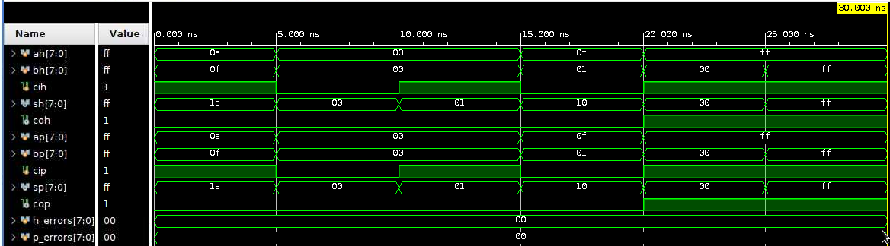
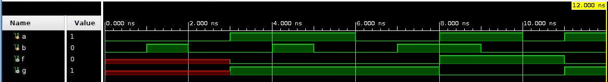
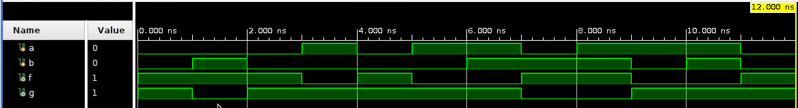

# Digital Logic & Hardware Architecture Fundamentals

## Overview
This repository contains structural and behavioral Verilog implementations of core combinational and sequential logic components. Developed as part of ECE 206: Contemporary Logic Design at Princeton University, these modules demonstrate fundamental design paradigms used to construct Arithmetic Logic Units (ALUs), datapath routing, and memory architectures.

## Hardware Modules

### Combinational Logic
*   **1-Bit Full Adder:** Implemented structurally utilizing continuous assignment and bitwise logic operations[cite: 3].
*   **8-Bit Hierarchical Adder:** A ripple-carry architecture engineered by instantiating and daisy-chaining eight 1-bit Full Adder modules[cite: 11].
*   **8-Bit Procedural Adder:** A behavioral combinational logic implementation utilizing `always @(*)` blocks and direct arithmetic operators for optimized synthesis[cite: 10].
*   **3x8 Decoder:** Designed memory address decoding logic utilizing two methodologies: a structural continuous assignment model mapping explicit Boolean gate logic, and a behavioral model utilizing synthesized `case` statements[cite: 13, 14]. 

### Sequential Logic
*   **SR NAND Latch:** Designed utilizing two distinct methodologies: a structural layout using cross-coupled active-low logic gates, and a behavioral model employing a state-defining `case` statement[cite: 5, 6].
*   **D Flip-Flop (MemBlock):** 
    *   *Structural:* Engineered a reliable edge-triggered memory element utilizing a complex three-latch architecture to synchronize inputs[cite: 2].
    *   *Behavioral:* Designed a streamlined synchronous block that strictly samples input (`y`) on the positive edge of the clock signal (`posedge x`)[cite: 8].

## Simulation & Verification
Verification was conducted utilizing custom Verilog testbenches to confirm accurate edge-triggered data capture, correct combinational arithmetic logic, and asynchronous state retention across various test cases, including maximum integer rollover for the 8-bit adder architectures[cite: 4, 7, 9, 12, 15].

### Waveform Visualizations

**8-Bit Adder Datapath Verification**

> **Simulation Notes:** The waveform verifies multi-bit binary arithmetic, demonstrating accurate sum and carry-out generation across the 8-bit input vectors for both hierarchical and procedural architectures[cite: 12].

**Edge-Triggered D Flip-Flop (MemBlock)**

> **Simulation Notes:** The simulation confirms the flip-flop properly captures the input data strictly on the rising edge of the clock, updating the primary output synchronously[cite: 7, 8].

**Asynchronous SR Latch**

> **Simulation Notes:** Verifies the state-holding behavior and proper output stabilization in response to sequential active-low set and reset signals[cite: 4, 6].

## Technologies Used
*   **Hardware Description Language:** Verilog
*   **Concepts:** Gate-Level Design, Combinational Arithmetic, Sequential State Machines, Synchronous/Asynchronous Logic, Testbench Verification
